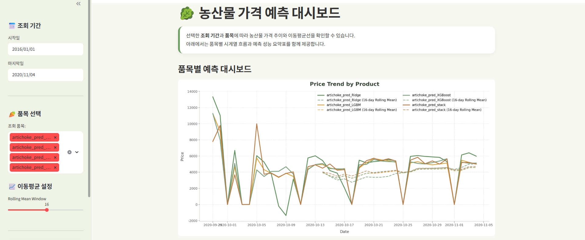

# Agricultural Price Forecasting ML Project

This data analytics and machine learning project uses agricultural distribution data to build **machine learning models that forecast future prices for seven major agricultural products** and deploys the forecasts through a **Streamlit dashboard**.

The project covers the full workflow, including EDA, time-series feature engineering, comparisons of Prophet, ML, and ensemble models, SHAP-based interpretation, and Streamlit deployment.


## What I Demonstrated In This Project

- Ability to define problems using real-world public and distribution data
- Experience in time-series EDA and preprocessing
- Experience in experimenting with and comparing ML regression and ensemble models
- Ability to interpret models using SHAP
- Experience in building a data product with Streamlit
- Ability to interpret analytical results from a business perspective




*Website screenshot (url: https://prediction-ml-ppck75.streamlit.app/)*


## 1. Project Overview

### Problem Definition
- Agricultural prices are significantly affected by seasonality, holidays, supply and demand instability, and external events.
- For products with high price volatility, determining purchase timing and quantities is difficult, which can lead to inventory and disposal costs.
- Therefore, this project aims to **forecast prices by product** based on historical transaction data and provide practical decision-support indicators.

### Business Relevance
- Fresh-food e-commerce companies such as Market Kurly procure products through a **direct-purchasing model** and manage the associated logistics themselves.
- Under this model, sharp price fluctuations can significantly affect procurement costs, inventory risk, and logistics efficiency.
- The price forecasting models in this project can support decisions such as:
  > Determining the appropriate time to purchase
  > Proactively managing inventory in response to supply and demand changes
  > Managing the risk of potential price surges
  > Supporting promotional and sales policy planning

(Source: Machine learning course materials by Liam, an instructor at Metacode)

## 2. Dataset

### Data Source
- [농넷 | Agricultural Distribution Information System](https://www.nongnet.or.kr/index.do)

### Data Description
- Agricultural distribution data accumulated over approximately four years or more, starting from 2016-01-01
- Includes **transaction volume** and **price (KRW/kg)** information for each product
- The target was **limited to the price variable** to keep the project focused on price forecasting

### Products Forecasted
- Napa cabbage
- Korean radish
- Garlic
- Onion
- Green onion
- Dried chili pepper
- Perilla leaf

These products were considered to have high forecasting value in real-world distribution and retail because they are highly sensitive to price changes and prone to supply and demand instability.

## 3. Objectives

- Conduct EDA that reflects the characteristics of time-series data
- Design date-based and lag-based feature engineering
- Compare the performance of Prophet and machine learning regression models
- Improve forecasting performance through post-processing and ensembling
- Visualize the results with Streamlit and deploy them as a dashboard (url: https://prediction-ml-ppck75.streamlit.app/)

## 4. Project Workflow

*This project was developed with reference to Liam's kaggle_실전 머신러닝 course at Metacode.*

### 1) EDA
- Check for missing dates and chronologically sort the time series
- Visualize price trends by product
- Identify long-term trends using rolling means
- Analyze price patterns by day of the week and month
- Examine correlations among products
- Explore price movements around holidays and specific seasons

### 2) Feature Engineering
For notebook-based modeling, the following features were designed to improve time-series forecasting performance.

- Date-derived features
  - `year`, `month`, `day`, `day_of_week`
  - `is_weekend`, `is_holiday`
- Lag features
  - `lag_7`, `lag_14`
- Rolling statistics
  - rolling mean
  - rolling std

The key was not simply to forecast prices, but to **quantify historical patterns and calendar information so that the models could learn from them**.

### 3) Modeling

#### Baseline
- Prophet

#### Machine Learning Regressors
- Ridge Regression
- Random Forest Regressor
- LightGBM Regressor
- XGBoost Regressor
- MLP Regressor

#### Ensemble
- Average Ensemble
- Stacking Regressor

### 4) Post-processing
- Adjust forecasts for dates with atypical transaction patterns, such as Sundays and public holidays
- Notebook experiments showed performance improvements for some products after applying post-processing

This step is meaningful not merely as a technique for improving model scores, but as a **practical approach that incorporates domain rules into the forecasting results**.

## 5. Evaluation

### Evaluation Metric
- `MdAPE (Median Absolute Percentage Error, interpreted from an accuracy perspective)`

Because price scales vary substantially across products, the notebook experiments evaluated model performance using MdAPE, as a **relative-error-based comparison** was considered more appropriate than one based on absolute error.

### Experiment Summary
- Individual models exhibited different strengths depending on the product.
- XGBoost/RandomForest-based models performed well for some products, while the average ensemble delivered more stable performance for others.
- Overall, forecasting quality tended to improve after post-processing was applied.
- The notebook experiments confirmed that **the optimal model may differ by product**, suggesting that a product-specific model selection strategy is necessary for a real-world service.

## 6. Interpretability

- Identify the variables with the greatest influence on forecasts through SHAP-based feature importance
- Interpret the importance of historical prices (lags), rolling means, and calendar-based features
- Aim for modeling that not only produces accurate forecasts but also **explains what influences price fluctuations**

## 7. Deployment

### Streamlit Dashboard
- Visualize model forecasts alongside actual price trends
- Compare forecasting results by product
- Provide model performance summary tables
> Based on pre-generated agricultural price forecast data, the dashboard visualizes price trends for the product and period selected by the user and displays rolling-average lines and a model performance summary.
> It loads forecast data from the trained ML models and visualizes price trends and rolling-average lines by product.

## 8. Tech Stack

- Python
- Pandas, NumPy
- Matplotlib, Seaborn
- Prophet
- Scikit-learn
- LightGBM
- XGBoost
- SHAP
- Streamlit

## 9. Installation

### App Environment

To run only the Streamlit app, install the root `requirements.txt`.

```bash
pip install -r requirements.txt
streamlit run app.py
```

### Notebook Experiment Environment

To reproduce model training, EDA, and ensemble experiments, install `notebooks/requirements.txt`.

```bash
pip install -r notebooks/requirements.txt
```

It is recommended to manage the notebook file at the following path.

```bash
notebooks/agricultural_price_forecasting.ipynb
```

## 10. Key Takeaways

- I learned that in time-series problems, **preserving chronological order and preventing leakage** are far more important than simply applying regression models.
- I found that feature engineering can have a greater impact on performance than the choice of model itself.
- Post-processing informed by domain knowledge contributed to actual forecasting performance improvements.
- By deploying the analytical results with Streamlit, I learned that **how results are communicated** is as important to the project's overall quality as the technical implementation.


## 11. Future Improvements

- Add external variables such as weather, temperature, precipitation, and holiday demand
- Operate individually optimized models for each product
- Enhance Time Series Cross Validation
- Extend the forecast horizon and support multi-step forecasting
- Build an automated batch forecasting pipeline for a production environment

## 12. Reference

Instructor Liam / kaggle_실전_머신러닝 course materials (Metacode)

*I would like to thank Liam for the excellent course, which supported my learning and the development of this project.*

---

